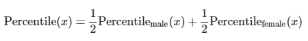
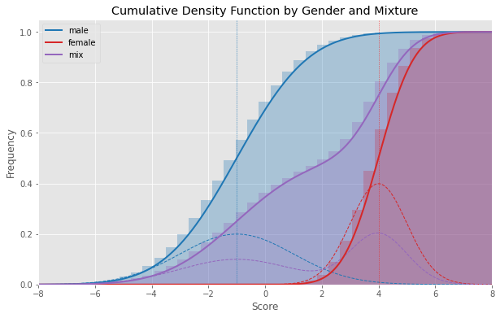

# fancy-stats
Some problems regarding statistics one may face as a data scientist.

## Combining statistics by gender for equal opportunity hiring:

  Want to be an equal opportunity employer but have data of, say some psychometric tests, only for gender-specific populations? 

Read if you want to know how you can combine it without asking for gender using percentiles

from the cumulative distributions

