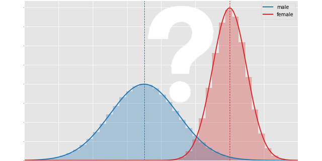

# fancy-stats
Some problems regarding statistics one may face as a data scientist.

## Combining statistics by gender for equal opportunity hiring:

  Want to be an equal opportunity employer but have data about, say some psychometric tests, only for gender-specific populations? 

Read the [notebook](./Combining_statistics_by_gender_for_equal_opportunity_hiring.ipynb) if you want to know how and why you can combine it without asking for gender using percentiles.

